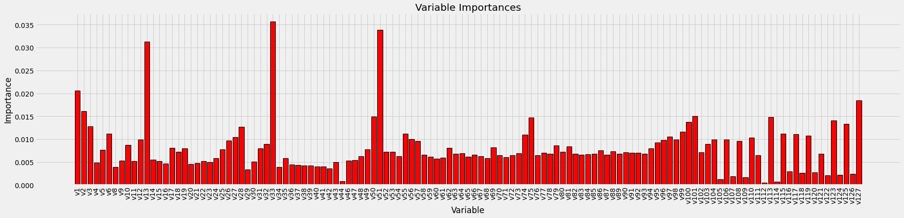
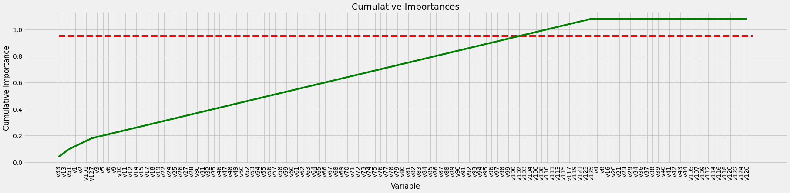
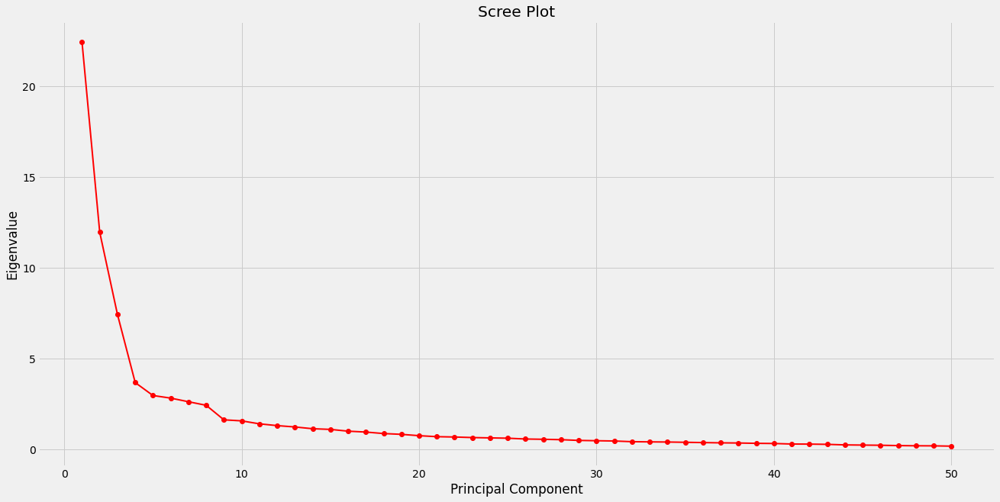

# Machine Learning Predictive Modeling

### Overview
We are provided data with 3 targets and 127 attributes (v1-v127). Multiple machine learning models will be explored to best predict one of the target variables. We will only be focusing on Binary Target 2 for this project.

### Targets
- cont.target (continuous target variable)
- binary.target1 (binary target)
- binary.target2 (binary target)

For the 2 binary targets, false positives are more costly than false negatives - certainty regarding predicted events is paramount and thus the accuracy of the model might best be scored using positive predictive value or lift at depth of 10-20%. Area under the ROC curve and Averaged Squared Error are also sound and common error metrics used in this application.

### Data Preparation
A preliminary random forest model was first built to find important features out of the 127 attributes and the number of features that composed 95% of feature importance cumulatively were chosen to be in the training data (see charts below). To further optimize the training process, principal component analysis was performed to reduce data dimensions if possible. After evaluating the scree plot, we decided to reduce the data down to the first 10 principal components.

 

### Results

|          Model        |    Accuracy   |    AUC    |
| --------------------- | ------------- | --------- |
|  Logistic Regression  |     83.23%    |   0.6463  |
|      Random Forest    |     83.64%    |   0.6226  |
|        XGBoost        |     84.00%    |   0.5702  |
|        LightGBM       |     83.02%    |   0.6516  |
|        **CatBoost**       |     **88.60%**    |   **0.7779**  |
|  K-Nearest Neighbors  |     80.72%    |   0.6107  |
